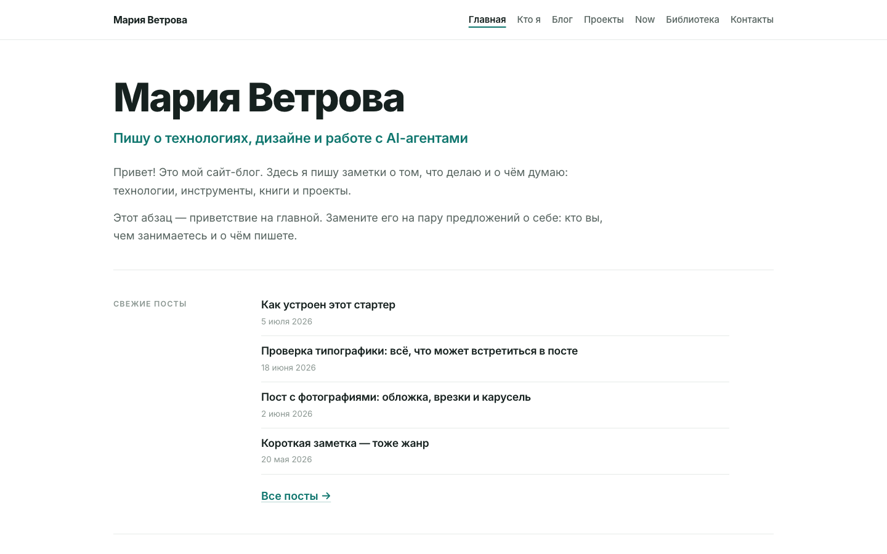
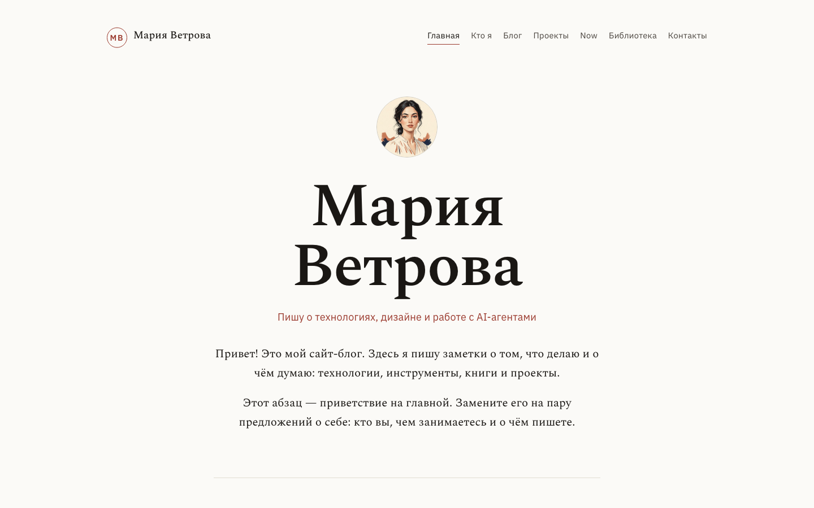
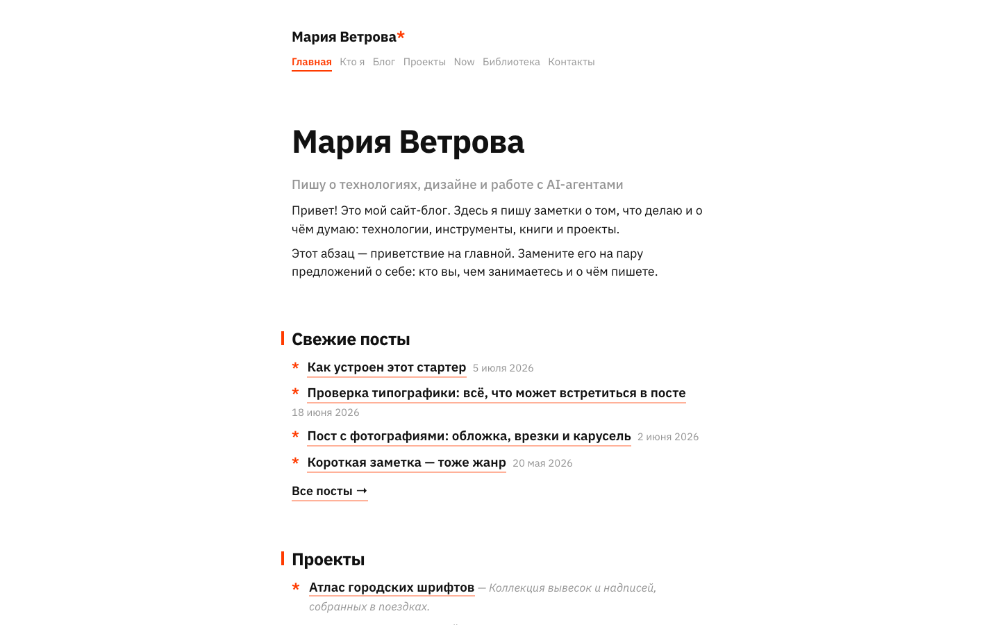
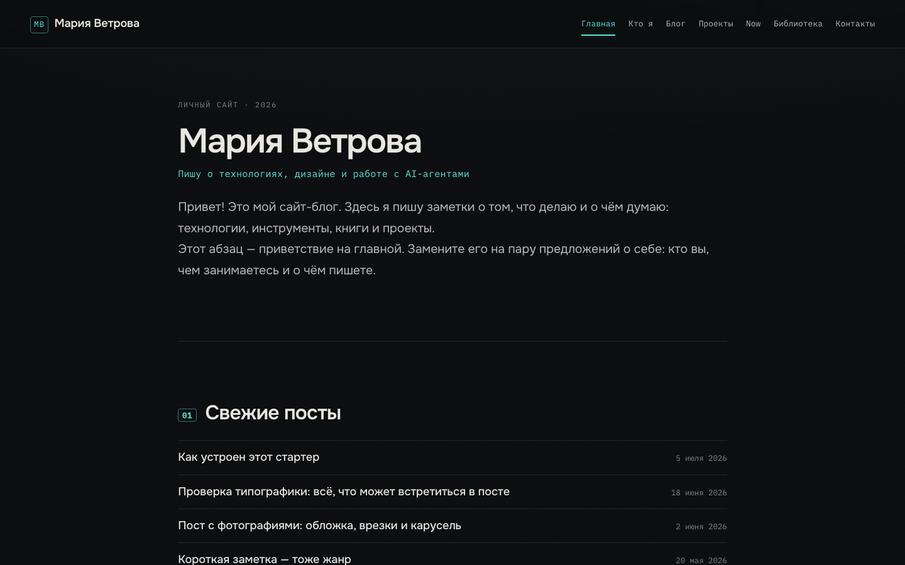

# blog-starter — личный блог на Hugo с четырьмя темами

Готовый стартер личного сайта-блога: скачайте, впишите своё имя, выберите тему — и публикуйтесь. Специально устроен так, чтобы его можно было целиком отдать AI-агенту (Claude Code, Codex и т.п.): инструкция для агента лежит в [AGENTS.md](AGENTS.md).

Собран на <a href="https://gohugo.io/" target="_blank" rel="noopener">Hugo</a> — генераторе статических сайтов: вы пишете посты в markdown, Hugo превращает их в готовый HTML без баз данных и админок. Никаких JS-фреймворков — одна CSS-таблица на тему и крошечный скрипт карусели.

## Четыре темы

| | |
|---|---|
| **meridian** — спокойный гротеск: белый фон, изумрудный акцент, сериф в тексте постов | **manuscript** — редакционный сериф: бумажный фон, буквица, нумерация секций |
|  |  |
| **signal** — дерзкий минимализм: узкая колонка, огненный акцент, звёздочки-маркеры | **midnight** — тёмная инверсия: почти чёрный фон, циановый акцент, duotone-фото |
|  |  |

Так темы отрисовывают один и тот же пост: [meridian](screenshots/meridian-post.png) · [manuscript](screenshots/manuscript-post.png) · [signal](screenshots/signal-post.png) · [midnight](screenshots/midnight-post.png).

Темы — авторские, написаны с нуля (MIT). Стилистически вдохновлены личными сайтами, которые нам нравятся, — это референсы настроения, не копии.

## Быстрый старт

```bash
# 1. Hugo (нужна версия extended ≥ 0.146)
brew install hugo          # macOS; для других ОС — github.com/gohugoio/hugo/releases

# 2. Запуск
git clone <этот-репозиторий> my-blog && cd my-blog
hugo server                # → http://localhost:1313
```

Самый простой путь дальше — **отдать папку своему AI-агенту** и сказать: «разверни мне этот блог, меня зовут …, пишу о …». Всё, что агенту нужно знать, уже написано в [AGENTS.md](AGENTS.md). Ручной путь — ниже.

## Выбор темы

Активная тема — одна строка в `hugo.toml`:

```toml
theme = "meridian"   # meridian · manuscript · signal · midnight
```

Посмотреть другую тему, не меняя конфиг: `hugo server --theme midnight`. Собрать все четыре сразу и переключаться между ними в браузере:

```bash
./scripts/preview-all.sh
cd public-preview && python3 -m http.server 8000   # → http://localhost:8000
```

## Сделать блог своим

1. **`hugo.toml`** — `title` (ваше имя), `baseURL` (ваш домен), в `[params]` — `author`, `tagline`, `description`.
2. **`data/site.yaml`** — почта, телеграм, гитхаб, текст подвала, список проектов.
3. **`assets/img/hero.jpg`** — замените плейсхолдер своим портретом (страница «Кто я»).
4. **`content/*.md`** — страницы «Кто я», «Проекты», «Now», «Библиотека», «Контакты» заполнены текстами-образцами: замените их своими. Ненужную страницу просто удалите (и уберите пункт меню в `hugo.toml`).
5. **Посты** — папки в `content/blog/`. Новый пост: `hugo new content --kind blog blog/moy-post`. Обложка — `cover.jpg` рядом с `index.md`, картинки — в `img/`. Четыре демо-поста показывают все возможности (типографика, фото, карусель) — потом удалите их.

## Кастомизация темы

Все токены стиля собраны CSS-переменными в начале `themes/<тема>/assets/css/main.css` — характер темы меняется парой строк:

```css
:root {
  --accent: #0f766e;   /* поменяйте — и все ссылки/акценты перекрасятся */
  --dot: #d97706;      /* цвет буллетов */
  --maxw: 860px;       /* ширина колонки */
}
```

**Пример: включить/выключить засечки в тексте постов** (тема meridian). Тело поста набрано серифом PT Serif — за это отвечает переменная `--font-serif` и правило `.post .prose`. Хотите другой сериф — подключите его `<link>`-ом в `layouts/baseof.html` темы и поменяйте переменную; хотите гротеск — замените в `.post .prose` шрифт на `var(--font)`.

## Публикация

- **GitHub Pages** — уже настроено: включите Pages в настройках репозитория (Source: «GitHub Actions») и пушните в `main` — workflow [.github/workflows/hugo.yml](.github/workflows/hugo.yml) соберёт и выложит сайт.
- **Свой сервер (VPS)** — `cp deploy-vps.sh.example deploy.sh`, впишите SSH-хост и веб-корень. Скрипт по умолчанию делает dry-run, реальная заливка — `./deploy.sh --go`.
- **Vercel / Netlify / Cloudflare Pages** — подключите репозиторий; build command `hugo --gc --minify`, publish directory `public`, переменная окружения `HUGO_VERSION=0.162.1`.

## Лицензия

MIT ([LICENSE](LICENSE)). Hugo — отдельный открытый проект (Apache 2.0), сюда не входит и ставится самостоятельно. Шрифты подключаются с Google Fonts (лицензия OFL).
