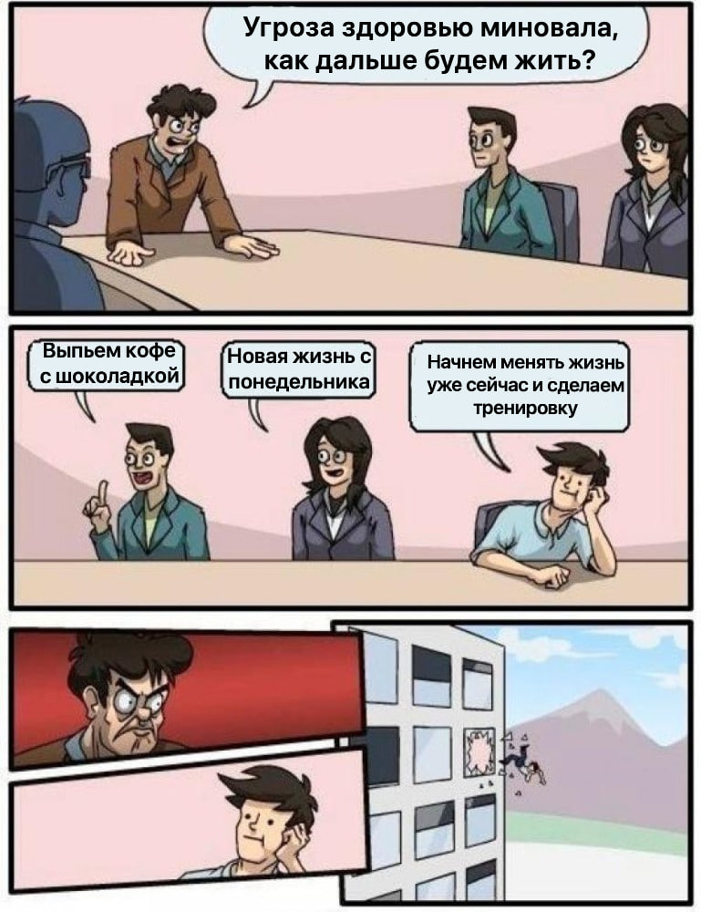
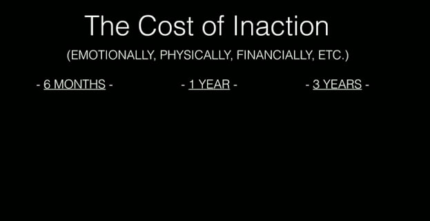
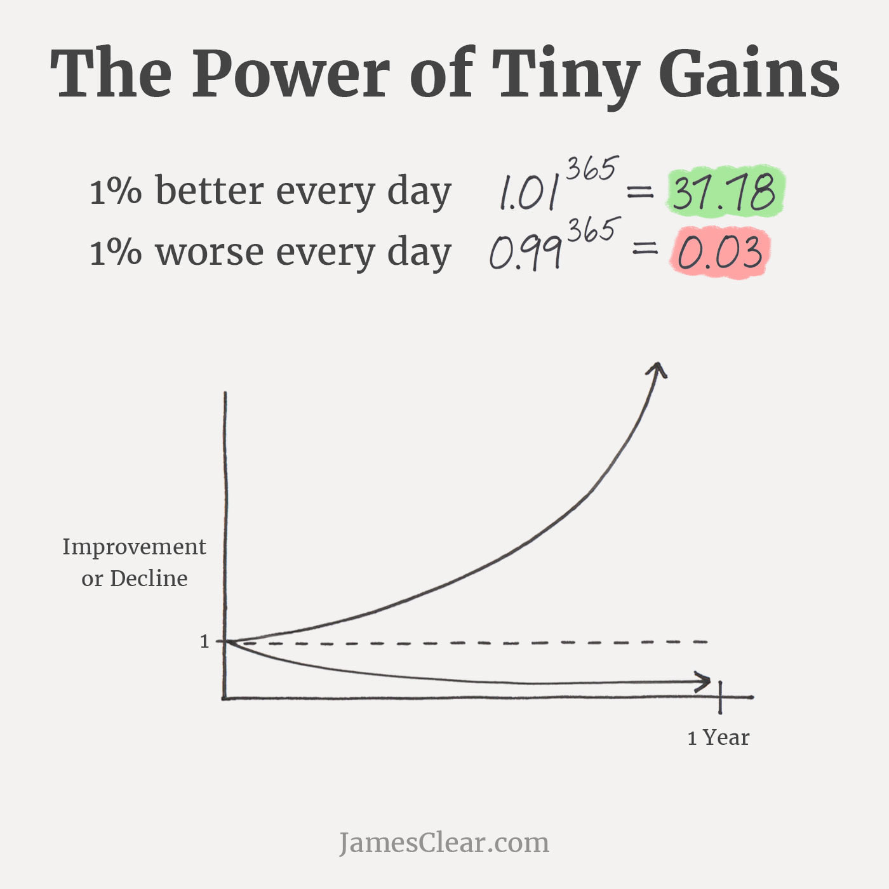

Есть довольно популярный совет: если хочешь начать заниматься спортом, правильно питаться или вообще что-то изменить, представь свою жизнь через 10–20 лет, как будто ты уже всего этого достиг.

Вот ты здоровый, сильный, хорошо выглядишь и легко двигаешься. Почувствуй, как тебе там хорошо, и используй эти ощущения как мотивацию.

Я и так знаю, что спорт полезен. Думаю, это вообще не самая секретная информация на планете, как и то, что лучше нормально питаться, высыпаться и чистить зубы два раза в день.

Проблема в том, что между этим знанием и реальным действием лежит дискомфорт от усилий. А ещё работа, семья, книга, сериал и примерно сто других вещей, которыми проще и приятнее заняться прямо сейчас.

И тем более сложно делать выбор в пользу будущего, если в целом всё нормально.

---

О возрасте тоже долго не задумываешься. Вот уже 36. Ты ходишь, работаешь, путешествуешь, ничего особо не болит, разве что есть лишний вес и иногда что-то беспокоит короткое время. Хотелось бы быть спортивнее, но никакой катастрофы нет.

И недавно у меня сработала неожиданная визуализация будущего.

Я не люблю приседания как упражнение. В процессе возникают неприятные ощущения в коленях, и давно надо бы заняться укрепляющими упражнениями. Раньше решение было простое: значит, не буду приседать.

А потом я как-то совершенно обычно присел для чего-то, колено заболело, и на следующее утро боль не прошла. Это наложилось на какое-то общее уставшее состояние и первой мыслью было: «А что же будет лет через 20?»

Через 20 лет мне будет 56 и это ведь вообще не тот возраст, в котором я собираюсь аккуратно сидеть у окна и вспоминать молодость. Я рассчитываю нормально ходить, путешествовать, быть активным, жить.

Несколько лет назад колено вообще не давало о себе знать, сейчас оно иногда мешает приседать, а моя стратегия сводится к тому, чтобы просто меньше им пользоваться. Каким тогда будет следующий участок этой траектории?

Конечно, боль в колене совершенно не означает, что через двадцать лет я не смогу ходить, но это сигнал.

---

Похожая история произошла с лечением зубов. Сейчас каждая вторая сторис в инстаграм про правильную гигиену зубов, а раньше что-то никто из врачей особо не торопился мне об этом рассказать, что и приводит сейчас к разным последствиям. Верите в заговор стоматологов?🌚

Я ехал на приём почти уверенный, что там глобальный пиздец. Кофе, сладкое, иногда не почистил зубы утром и второе лечение уже за короткое время - мозг неделю в ожидании рисовал страшные картинки, представляя худшее.

На страхе я моментально стал образцовым человеком. Одной чашки кофе достаточно, печенье сегодня последнее в жизни, а зубы чистим сразу же после завтрака.

Потом стоматолог посмотрел и сказал, что всё значительно менее страшно, чем я себе придумал. Один кариес полечили, ещё кое-что надо сделать, но никакой катастрофы.

И буквально в тот же момент внутренний департамент рисков был расформирован. Значит, нормально живём, можно булочку и кофе в Starbucks на обратном пути.

Угроза исчезла, вместе с ней исчезла значительная часть мотивации.

---

> You should be far more concerned with your current trajectory than with your current results.
>
> — James Clear

Мне стало интересно: почему мы так много думаем о желаемой версии будущего себя и гораздо реже смотрим на версию, которая уже понемногу собирается из наших сегодняшних привычек?

Получается, вопросы «Как хорошо мне будет, если я начну заниматься спортом?» и «О чём я буду жалеть через десять лет, если продолжу жить ровно так же?» для мозга, похоже, совсем не одно и то же.

В процессе изучения наткнулся на одну интересную штуку - Fear-Setting Тима Ферриса.

Когда мы думаем о каком-то изменении, мы отлично умеем считать цену действия. Сменю работу, могу потерять в деньгах. Начну проект, могу провалиться. Пойду к врачу, вдруг найдут что-нибудь неприятное.

Феррис предлагает посчитать ещё и Cost of Inaction, цену бездействия, которую почти не учитываем. А что будет, если я не сменю работу, не начну проект, не пойду к врачу?

Мне кажется, это упражнение Ферриса можно использовать и как оценку бездействия для слабых сигналов нашей жизни, которые легко проигнорировать. Когда мы еще не собираемся что-либо делать, нет потенциального действия.

Что в моей жизни сегодня уже является маленьким негативным сигналом? Что будет, если ничего с ним не делать и дать этой тенденции ещё 10–20 лет?

Мало двигаюсь, побаливает колено, начались проблемы с зубами, стал хуже спать, меньше энергии...

Каждая такая вещь сама по себе пока может быть совершенно терпимой и исправимой - это ощущения в моменте, сейчас.

Полезнее увидеть в ней начало графика: «Если линия сигнала продолжится с тем же трендом, где она окажется через двадцать лет?»

И вот небольшое упражнение, которое я хочу попробовать сам.

Выбрать один такой сигнал, что-то, про что сейчас легко сказать «да нормально», и продолжить его во времени:

• Сейчас: что уже происходит?

• Через год: что будет, если ничего не менять?

• Через 5 лет: во что это может превратиться?

• Через 20 лет: устроит ли меня эта версия моей жизни?

А потом добавить ключевой вопрос:

Что я могу изменить сейчас, чтобы немного поменять наклон этой линии?

💡Иногда нескольких градусов, 1 процента сегодня достаточно, чтобы через двадцать лет оказаться совсем в другом месте.

Возможно, именно этого и не хватает в размышлении про будущее: не только образа жизни, которую я хочу построить, но и честного взгляда на жизнь, которую я параллельно строю просто по инерции.

**Полезные ссылки**

• Тим Феррис, <a href="https://www.youtube.com/watch?v=5J6jAC6XxAI" target="_blank" rel="noopener">«Why you should define your fears instead of your goals»</a>. 13-минутное выступление TED про Fear-Setting. В том числе там есть Cost of Inaction: что будет через 6 месяцев, год и 3 года, если ничего не менять

• <a href="https://tim.blog/2017/05/15/fear-setting/" target="_blank" rel="noopener">Описание Fear-Setting и само упражнение</a>

• Джеймс Клир, <a href="https://jamesclear.com/atomic-habits" target="_blank" rel="noopener">«Атомные привычки»</a>
