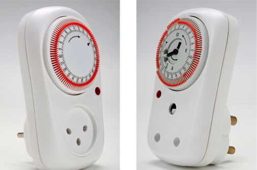
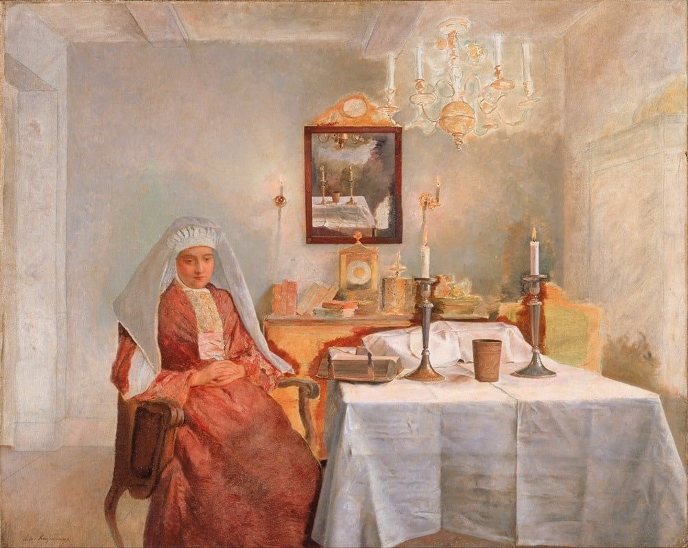

Вчера должен был получиться отличный семейный выходной, мы планировали только отдыхать, но к трём часам дня стало понятно, что план провалился.

В субботу мы так и договорились: выходной, ничего не планируем, играем в настолки, что-нибудь смотрим. И между делом проскочило, что хорошо бы разобрать одну коробку, мы же только переехали, и капусту пора солить, и занавески закинуть в стирку, но это быстро, мы всё равно весь день отдыхаем.

Утром позавтракали и закинули занавески. Чтобы их подготовить, пришлось отцепить все крепления, а ещё осталось немытое окно в спальне, помыли его, пять минут всего же. Капуста ждать уже не могла, поэтому параллельно начали её резать.

Каждое дело мелкое, но они цеплялись друг за друга и разрастались. Пока дошли до магазина, было три часа дня, потом сели с ребёнком за уроки, и наступил вечер. Сели наконец играть в настольную игру, параллельно готовя ужин.

К концу дня я вроде что-то сделал, но не отдохнул, как планировали.

**Почему обычные советы не спасают**

Советов про выходной хватает: не открывать ноутбук, отключить уведомления, устроить цифровой детокс, развести рабочее и свободное время, заранее запланировать активности. Всё это разумно, но работает у меня через раз.

Ломается часто в одном месте. Появляется дело на пять минут, сделать его кажется дешевле, чем про него помнить, я берусь, оно вытягивает следующее, и выходной рассыпается.

Между делом я как бы в шутку бросил: «Надо нам сделать по воскресеньям свой шабат».

**Шабат. Отделённый день**

Со стороны шабат выглядит как список запретов, местами доходящих до абсурда для человека, далёкого от религии, где нельзя даже мелкую работу (нельзя открывать книгу с надписью на обрезе, замыкать электрическую цепь). Но за запретами лежит идея отдельного дня.

В свободный день просто нет планов, а шабат отделён от остальной недели.

Авраам Йошуа Хешель в книге «Шабат» (1951) назвал его <a href="https://www.myjewishlearning.com/article/shabbat-as-a-sanctuary-in-time/" target="_blank" rel="noopener">«святилищем во времени»</a>: шесть дней человек переделывает мир, один день просто в нём находится.

> Смысл Шабата — праздновать время, а не пространство. Шесть дней в неделю мы живём под тиранией вещей пространства; в Шабат мы пытаемся настроиться на святость во времени.

Хешель был философом и раввином. Он уехал из Польши за шесть недель до вторжения нацистов, позже стал профессором в Нью-Йорке и шёл в марше в Сельме рядом с Мартином Лютером Кингом. «Шабат» он написал в 1951-м, задолго до всех разговоров про выгорание.

**Запрещено переделывание мира**

В шабат запрещены 39 мелахот. Это категории работы, выведенные из списка действий, которые понадобились для постройки Скинии (переносной ветхозаветный храм, который израильтяне построили в пустыне после исхода из Египта), и дело тут не в работе или усталости от неё.

Двигать тяжёлый шкаф внутри квартиры можно, а вынести из дома лёгкую вещь на улицу нельзя (запрещён перенос вещи из своего владения в общее). Считается категория действия: мелаха означает созидательное вмешательство, демонстрацию власти человека над миром.

В этом списке есть готовка, стирка, замешивание теста, разжигание огня, строительство, то есть ровно то, чем мы вчера занимали воскресенье. Традиция внесла эти дела в список тысячи лет назад именно потому, что они возвращают в режим «переделывать».

**Почему это работает и без религии**

Незакрытая задача не лежит тихо и сама всплывает в голове. Это <a href="https://en.wikipedia.org/wiki/Zeigarnik_effect" target="_blank" rel="noopener">описала</a> ещё в 1927-м Блюма Зейгарник.

Масикампо и Баумайстер (2011, <a href="https://users.wfu.edu/masicaej/MasicampoBaumeister2011JPSP.pdf" target="_blank" rel="noopener">шесть исследований</a>) подтверждают уже знакомую мысль: чтобы незавершённое дело перестало постоянно всплывать в голове, его необязательно сначала закончить. Помогает составить конкретный план: что именно и когда ты будешь делать дальше. Задача остаётся незавершённой, но её когнитивное влияние ослабевает, мозгу больше не нужно постоянно напоминать о ней.

Это и есть механика кануна. Шабат начинается в пятницу вечером, когда всё уже приготовлено и закрыто.

<a href="https://www.tandfonline.com/doi/full/10.1080/19012276.2018.1443280" target="_blank" rel="noopener">Исследования восстановления после работы</a> выделяют четыре механизма: detachment (перестать мысленно работать), relaxation, mastery (заняться чем-то интересным вне работы) и control (самому решать, как провести время). Первый из них у меня и ломается, мысленно я могу быть в задачах, даже когда нет конкретной для выполнения задачи сейчас.

**Что я планирую на этой неделе**

Я решил перенести эту логику на своё воскресенье и собрать себе светский шабат. Прошлые попытки держались на честном слове, поэтому теперь у дня появляется закон, который нельзя нарушить даже на пять минут.

Граница: начало в субботу в 20:00, конец в воскресенье в 20:00. Начало и конец должны быть видимыми событиями, иначе всё скатывается в «ну сегодня постараюсь отдыхать».

Перед входом я отведу час на закрытие: пройтись по неделе, выписать все хвосты и следующие шаги, приготовить еду, сделать какие-то домашние дела или просто запланировать их. Мозгу нужна галочка, что это не забыто и где-то зафиксировано.

Планирование недели переезжает с воскресного вечера на утро понедельника.

⛔ Нельзя: работа, учёба «на пользу», финансы, крупные покупки, оптимизация дома, планирование проектов, и особенно «я только на пять минут».

✅ Можно: семья, настолки, прогулка, художественная книга, длинный завтрак, сауна, гости, сон, легализация скуки.

💡 Главное правило: этот день нельзя использовать, чтобы стать лучшей версией себя.

**Зачем такая жёсткость**

Мягкое правило не работает: «если что-то срочное, сделаю» означает, что возможность открыта весь день, и голова про это знает.

Тиффани Шлейн держит семейный <a href="https://www.tiffanyshlain.com/tech-shabbat" target="_blank" rel="noopener">Tech Shabbat</a> больше пятнадцати лет: в пятницу вечером в доме выключаются все экраны до вечера субботы. Её аргумент простой, пока правило обсуждаемо, ты обсуждаешь его целый день.

Мы обычно думаем так: работаю, устаю, отдыхаю, чтобы снова лучше работать.

Шабат меняет причинность. Я работаю шесть дней, чтобы один день иметь право не быть функцией. Не воскресенье служит неделе, а неделя ведёт к воскресенью.

Если воскресенье существует ради более продуктивного понедельника, работа уже захватила выходные.

В ближайшее воскресенье пробую первый раз и поделюсь результатами.

А у вас есть день, когда вы ничего не переделываете?

**Что почитать**

• Авраам Йошуа Хешель, <a href="https://sinagoga.jeps.ru/Pdf/shabat.pdf" target="_blank" rel="noopener">«Шабат»</a> (1951), про святилище во времени. По ссылке русский перевод целиком

• Джудит Шулевиц, <a href="https://www.penguinrandomhouse.com/books/166512/the-sabbath-world-by-judith-shulevitz/" target="_blank" rel="noopener">«The Sabbath World»</a> (2010), светский взгляд и история выходного дня

• Тиффани Шлейн, <a href="https://www.tiffanyshlain.com/books" target="_blank" rel="noopener">«24/6: The Power of Unplugging One Day a Week»</a> (2019)

• <a href="https://users.wfu.edu/masicaej/MasicampoBaumeister2011JPSP.pdf" target="_blank" rel="noopener">Masicampo & Baumeister, «Consider It Done!»</a> (JPSP, 2011), про планы и незакрытые задачи

• <a href="https://toldot.com/39rabot.html" target="_blank" rel="noopener">Список 39 мелахот</a> на toldot.com
