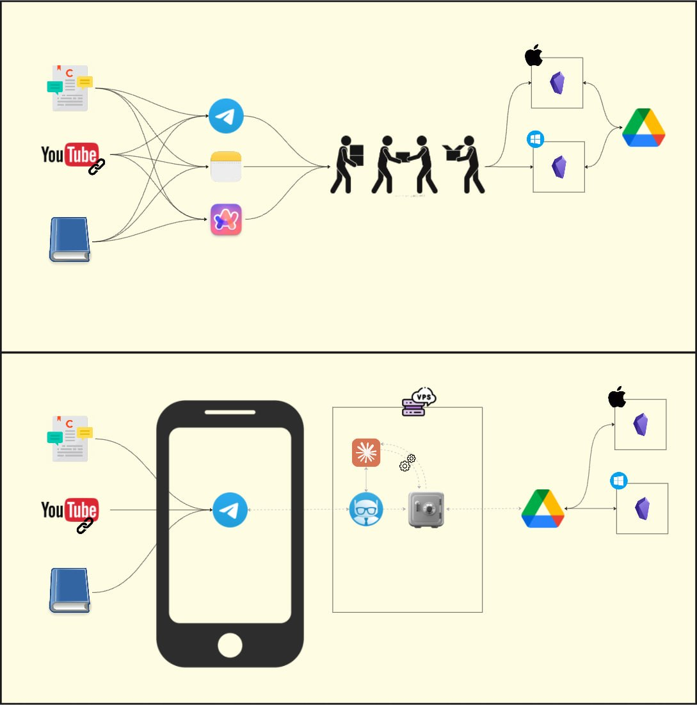
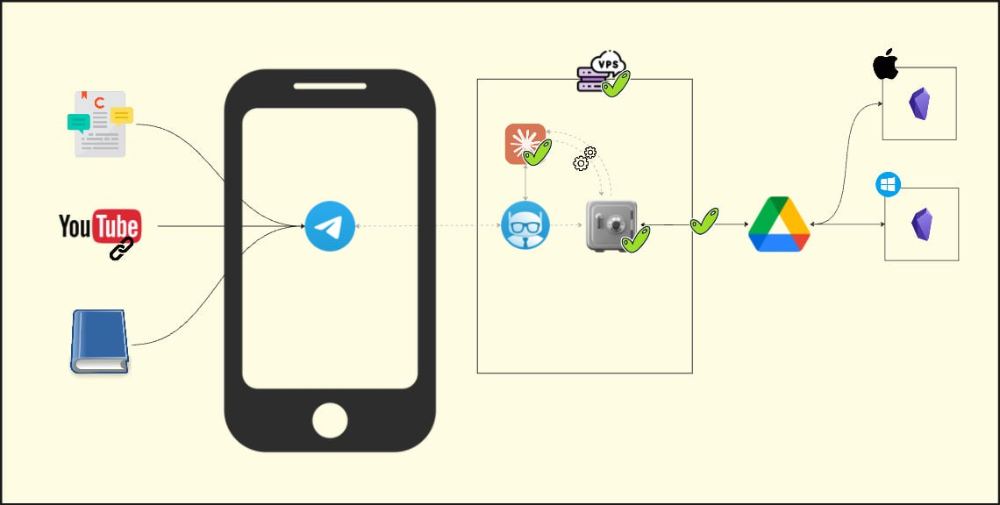

А началось всё с одного видео на YouTube. Автор создал себе персонального ИИ-ассистента на сервере (<a href="https://youtu.be/7BfIXbGp8q4?is=BC74wwFbafjZn1Aq" target="_blank" rel="noopener">вот это видео</a>). Тот каждый день обновляет и синхронизирует хранилище заметок, шлёт стратегические сводки в Telegram, помнит про клиентов, отвечает на вопросы. И всё это можно развернуть по инструкции в <a href="https://github.com/smixs/agent-second-brain" target="_blank" rel="noopener">репозитории</a>.

Посмотрел и подумал: это нам надо🤩

Раньше свободу фантазии ограничивал функционал ChatGPT, необходимость подключать API ключи или просто универсальные решения на рынке без гибкости. К тому же у меня уже давно была конкретная боль: слишком много мест, куда я что-то сохраняю. Telegram избранное, заметки на телефоне, Obsidian, рандомные вкладки браузера. Хочу сохранить рекомендацию книги — приходится думать, куда. Это тратит мыслетопливо в моменте и аукается потом, когда надо найти сохранённое. (Знаю, есть плагины синхронизации, Readwise, но вот не настроил раньше🤷‍♂️)

💡Идея простая: одна точка входа — Telegram-бот. И одно хранилище — Obsidian. Бот принимает всё: книги, ссылки на видео, мысли, рекомендации и кладёт в правильное место. А бонусом туда же встраивается Claude, который помогает гибко работать с этой структурой и общается через бота.

Из плюсов — я давно визуализировал свои потоки информации и понимал слабые места системы. Идеальный процесс, как я его когда-то представлял, видно на схемах в конце поста. Нарисовал to-be схему и решил двигаться маленькими шагами функциональности.

---

Первый практический шаг — нужен сервер. Поискал, сравнил несколько вариантов, выбрал <a href="https://contabo.com/en/" target="_blank" rel="noopener">Contabo</a>: в Европе, недорого, хорошие характеристики. Взял минимальный тариф, чтобы протестировать (4 vCPU, 8 GB RAM, 150 SSD).

И вот тут произошло кое-что важное.🤯

Раньше я настраивал сервер через ChatGPT. Захожу, спрашиваю что делать, он присылает команды, я ввожу. Ошибка — снова спрашиваю. Ещё ошибка — снова. За пару-тройку часов можно было что-то настроить.

Claude Code перевернул эту игру.

Говорю: «У меня есть сервер, настрой». Он: «Дай логин и пароль». Даю и дальше магия. Он сам заходит по SSH, сам находит ошибки, сам их исправляет. Через 5-10 минут: «Готово, вот ключи, пользуйся».

ChatGPT, который присылает команды для копипаста, ощущается уже реально каменным веком (конечно, есть Codex, но это в целом про старый подход решать задачи в чате, а не с агентами).

---

Мой подход к организации информации в целом сейчас выглядит так: Obsidian Vault как основной инструмент, куда стекается вся информация. Работаю с ним на разных устройствах. Поэтому для синхронизации выбрал Google Drive, где заодно в облаке лежит backup. И не важно, работаю с ПК Windows или ноут Mac — везде будет актуальная информация.

После настройки сервера я подготовил на нём две вещи:

1. Установил Claude Code через Claude Code😎
2. Создал папку хранилища и включил синхронизацию с Google Drive — каждые 5 минут мой Obsidian Vault подтягивается на сервер и получает от него обновления.

---

Про следующие улучшения, Telegram-бота и то, как именно я сейчас общаюсь с хранилищем через него, расскажу в следующем посте.

А пока вопрос: у вас есть одна точка входа для всего, что хочется сохранить? Или тоже несколько мест и уже привычно? 🙂

---

Итого сделано:

- ✅ VPS
- ✅ Claude Code
- ✅ Vault
- ✅ Синхронизация папки Vault с Google Drive
