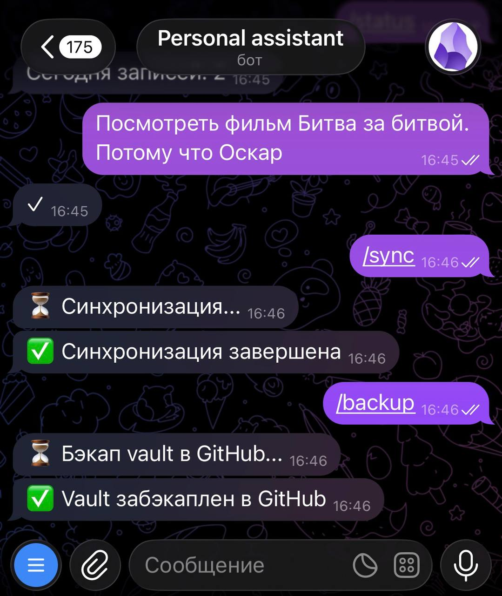
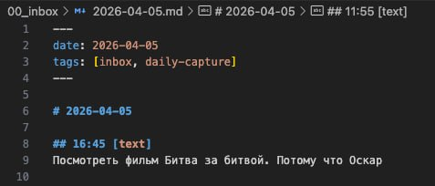

**Дисклеймер**

Я не программист, не пытаюсь им стать в этом проекте.

Мне интересно другое — собрать под свои реальные задачи рабочий инструмент, используя Claude Code как бадди по реализации.

В этой связке за мной остаётся главное: зачем, какую проблему хочу решить, как это должно работать. Claude Code берёт на себя детальное планирование, архитектуру, написание кода, анализ логов, исправление ошибок, готовку, уборку. Но всё же опыт реальной работы с кодом очень помогает выбирать стек, примерно понимать, чего можно добиться.

---

**Зачем вообще понадобился telegram-бот**

После того как обновились лимиты токенов в Claude Code, я начал следующий этап — telegram-бот.

Идея простая: сократить путь от мысли до хранилища и убрать вариативность путей записи.

Основная задача: быстро записывать заметки через telegram.

---

**Как я это реализовывал**

Telegram-бот и токен у меня уже были созданы раньше. Если бота нет, его можно создать через @BotFather, официальный бот Telegram. Любая ИИ поможет с этим.

Попросил Claude Code написать простого бота на aiogram и aiogram-dialog библиотеках — принимать текст из telegram и записывать в заметку текущего дня. Если заметки за сегодня нет — создаёт. (С кодом проекта сначала работаю локально и после уже отправляем на сервер.)

Для работы рекомендую загрузить в Claude Code плагин <a href="https://claude.com/plugins/superpowers" target="_blank" rel="noopener">Superpowers</a>. Это набор агентов, которые работают последовательно: сначала прояснение идеи, потом review, потом план, реализация и проверка. Такой подход уменьшает рассинхрон с общей логикой проекта.

Также крайне рекомендую загрузить mcp <a href="https://context7.com/mcp" target="_blank" rel="noopener">Context7</a>. Это mcp-сервер, который позволяет Claude Code получать доступ к актуальной документации и не галлюцинировать.

---

**Что оказалось важным по ходу**

Делать маленькими шагами. После каждого шага смотреть: работает ли, не сломалось ли то, что уже было. Иначе очень быстро всё превращается в кашу.

Сохранять рабочую версию между итерациями — синхронизировать с github, чтобы всегда оставалась точка отката для безопасных экспериментов.

Ошибки — часть процесса. Что-то не запускалось, что-то ломалось. Рабочий сценарий: говорить Claude Code, что именно не так, он смотрит логи и вносит правки. Процесс не стопорится на первой же технической проблеме.

---

Первой рабочей функцией телеграм-бота я реализовал запись заметок. Всё, что отправляю текстом, бот записывает в заметку текущего дня с меткой времени. Довольно быстро я перестроился и начал пользоваться этой возможностью. Захотелось сохранить рилс в Инстаграм — отправил боту ссылку с комментарием. Появилась мысль или идея — отправляю боту. Вместо нескольких мест, где я раньше это делал, теперь есть только одно. Это удобно. Оставил себе To-Do настроить чек-лист для ревью заметок в конце недели.

Но после этого захотелось улучшить процесс на реальном узком месте — синхронизации с google drive. Автоматическая синхронизация работала, но не всегда тогда, когда это было нужно. Поэтому я добавил команду /sync — она запускает синхронизацию хранилища с Google Drive. Полезно, когда нужно сразу подтянуть актуальное состояние, не ждать автоматического интервала в 5 минут.

Ещё одна мысль, которая возникла в процессе: не так часто возникает потребность открывать заметки на смартфоне, но было бы приятно иметь такую возможность. Решил совместить приятное с полезным и сделать заодно backup в github. Создал private репозиторий, добавил команду /backup — она выгружает текущую версию хранилища в github. На телефоне установил официальное приложение github, через него можно нормально открывать markdown-файлы. Это не замена работе с vault, но резервная возможность всегда открыть заметку для чтения и дополнительная страховка.

---

**Что в итоге**

Хранилище перестало быть просто пассивным архивом, который обновляется руками. У него появилась внешняя точка входа для сохранения и синхронизации.

- ✅ Запись в Inbox заметку дня
- ✅ Принудительная синхронизация хранилища
- ✅ Бэкап в github

---

