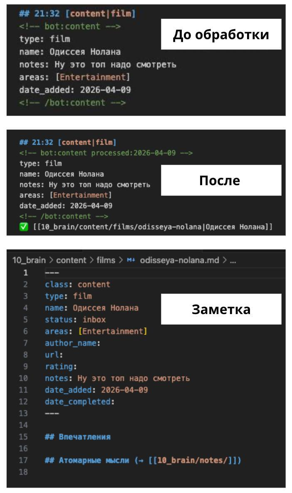

**Две задачи**

Когда токены опять😄 восстановились, я вернулся к боту. Следующий шаг логически дополнял функционал бота: добавить Claude в качестве собеседника. Но сразу встал вопрос — как разделить «работу бота» и «разговор с Claude».

Смешивать неудобно. Пишешь боту команду — он должен выполнить операцию. Пишешь Claude — он должен ответить. Это разные режимы.

---

**Кнопка «Разговор с Claude»**

Решение возможно не самое оптимальное, но быстрое — кнопка, активирующая режим общения. Нажимаю «Разговор с Claude» и включается режим общения. Пока режим активен, всё что пишешь идёт в Claude, он отвечает прямо в Telegram. Нажимаю «Остановить» и режим выключается, бот работает в обычном режиме.

Смысл разделения в том, что не каждая операция требует Claude. Записать мысль, запустить синхронизацию, сохранить ссылку — это фиксированные операции, быстрые и без токенов. Claude нужен, когда задача творческая или без чёткого алгоритма.

---

**Сохранение контента**

Параллельно я думал про контент — книги, фильмы, статьи. Хочу сохранять их в хранилище, но процесс должен быть максимально простым, без длинных форм.

Выбрал три поля: название, ссылка (если есть) и описание, зачем вообще сохраняю. Добавил кнопку «Сохранить контент», которая разворачивается в выбор типа (книга, фильм, статья и т.д.), а дальше бот по очереди спрашивает три вещи + домен и записывает с разными типами в заметку дня.

---

**YAML для обработки**

В первой итерации данные просто сохранялись строкой. Потом я подумал: это ведь логично обрабатывать через Claude, а значит нужен структурированный формат.

Спросил Claude, как удобнее хранить. Он предложил YAML-блок с фиксированной структурой. Мы его добавили и теперь каждая запись контента попадает в заметку дня в виде YAML.

---

Отдельно я попросил Claude сохранить в памяти логику обработки: когда прошу разобрать заметку дня, он проходит по всем YAML-блокам, создаёт заметки в нужных папках (книги в books, фильмы в films и т.д.), переносит информацию в метаданные и отмечает блок как обработанный.

Так у меня появился нормальный входящий поток для контента — быстро сохранить через бот, обработать через Claude.

---

**Что в итоге**

Бот прирос тремя функциями:

- ✅ Разговор с Claude из Telegram, который включается кнопкой и не мешает простым функциям
- ✅ Сохранение контента в inbox с YAML-структурой для последующей обработки
- ✅ Claude по запросу разбирает inbox заметки в хранилище и раскладывает контент в новые заметки по папкам

---

